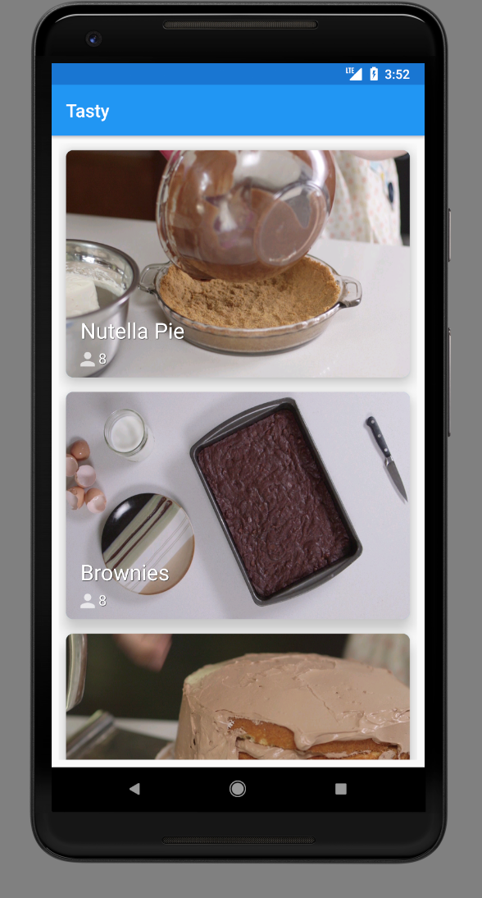
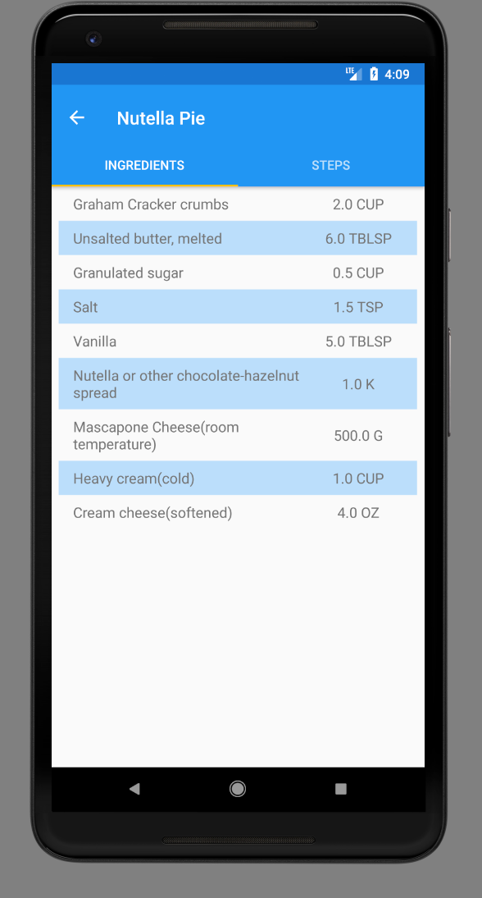
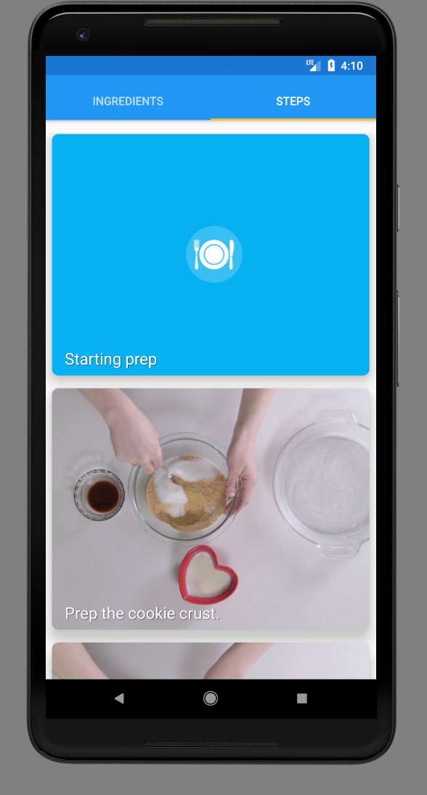
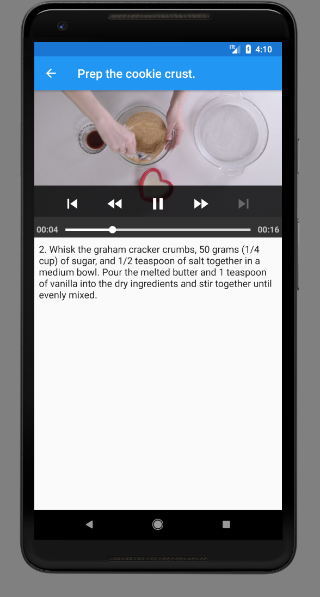
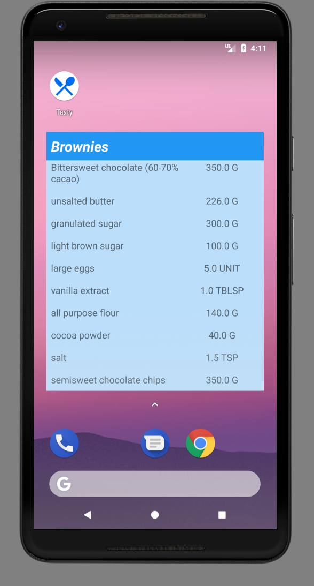
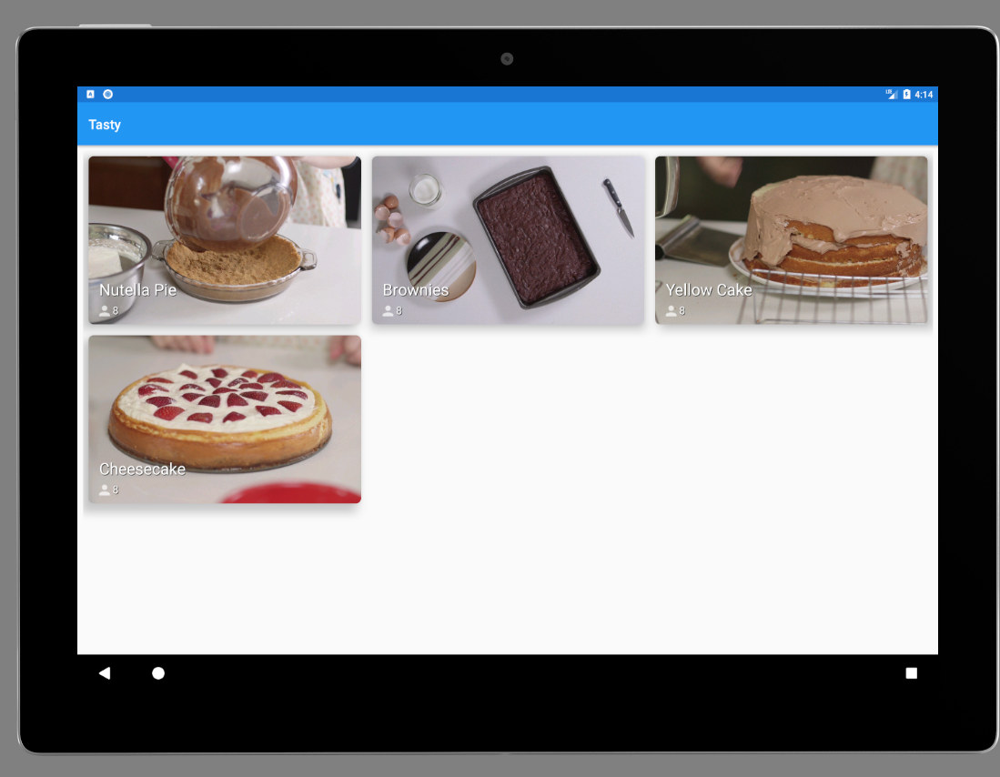
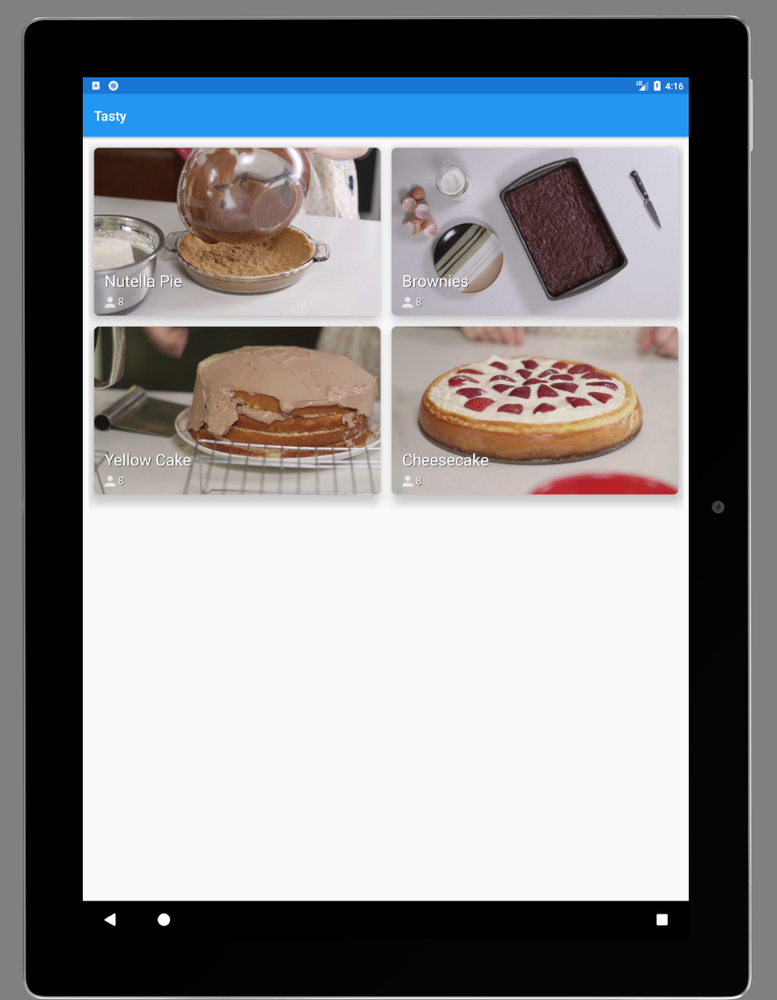
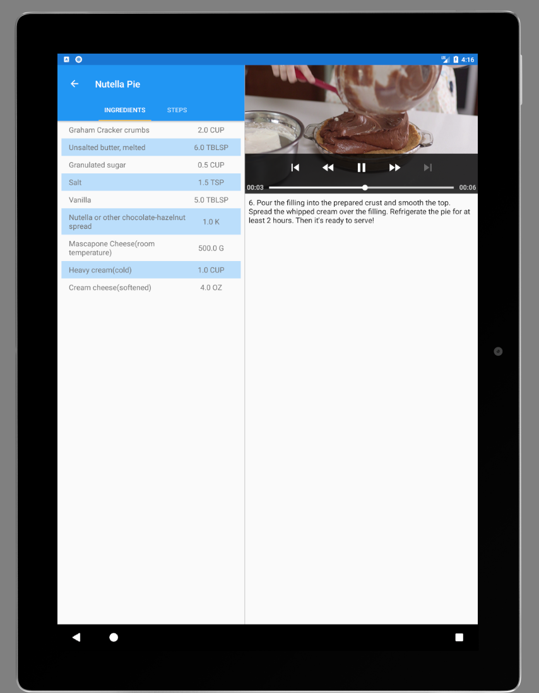

# BakingApp

App made for [Android Developer Nanodegree Program](https://www.udacity.com/course/android-developer-nanodegree-by-google--nd801).  This baking app will allow Udacity’s resident baker-in-chief, Miriam, to share her recipes with the world.

## Libraries Used

* [Glide](https://github.com/bumptech/glide)
* [Timber](https://github.com/JakeWharton/timber)
* [Parceler](https://github.com/johncarl81/parceler)
* [Room Persistence](https://developer.android.com/topic/libraries/architecture/room.html)
* [Gson](https://github.com/google/gson)
* [Retrofit](http://square.github.io/retrofit/)
* [RxJava](https://github.com/ReactiveX/RxAndroid)
* [ExoPlayer](https://github.com/google/ExoPlayer)
* [Espresso](https://developer.android.com/training/testing/espresso/index.html)

## App Screenshots

## Project Overview

You will productionize an app, taking it from a functional state to a production-ready state. This will involve finding and handling error cases, adding accessibility features, allowing for localization, adding a widget, and adding a library.

## Why this Project?

As a working Android developer, you often have to create and implement apps where you are responsible for designing and planning the steps you need to take to create a production-ready app. Unlike Popular Movies where we gave you an implementation guide, it will be up to you to figure things out for the Baking App.

## What Will I Learn?

In this project you will:

* Use MediaPlayer/Exoplayer to display videos.
* Handle error cases in Android.
* Add a widget to your app experience.
* Leverage a third-party library in your app.
* Use Fragments to create a responsive design that works on phones and tablets.
